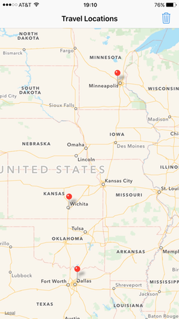
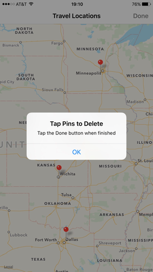
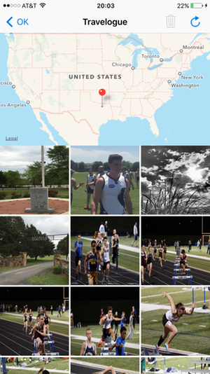
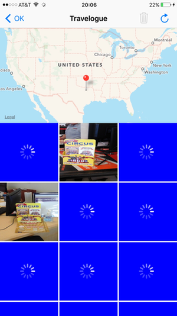
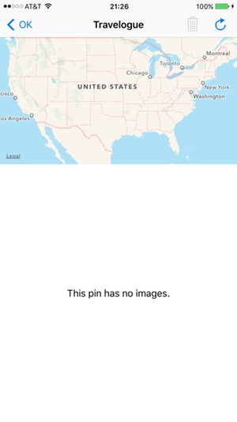
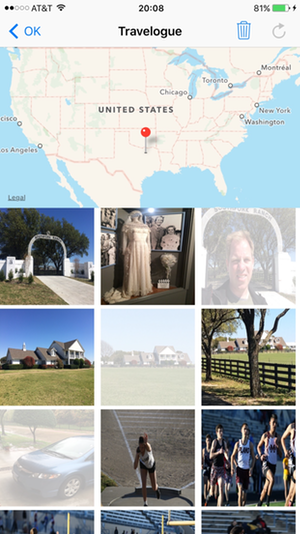

# &nbsp;&nbsp;&nbsp;&nbsp;&nbsp;VirtualTourist

VirtualTourist allows the user to drop a pin on a map, and then download photos from Flickr that are tagged with this location.  The photos and their association with the location of the pin are persisted across app sessions.

## Project

VirtualTourist is Portfolio Project #4 of the Udacity iOS Developer Nanodegree Program.  The following list contains pertinent course documents:
* [Udacity App Specification](./Paperwork/Udacity/UdacityAppSpecification.pdf)  
* [Udacity Grading Rubric](./Paperwork/Udacity/UdacityGradingRubric.pdf)  
* [GitHub Swift Style Guide](./Paperwork/Udacity/GitHubSwiftStyleGuide.pdf)  
* [Udacity Git Commit Message Style Guide](./Paperwork/Udacity/UdacityGitCommitMessageStyleGuide.pdf)  
* [Udacity Project & Code Reviews](https://review.udacity.com/#!/reviews/125674)  

|               | Project Submission       | Current State |
| :----------   | :-------------           | :------------ |
| Grade:        | ***Meets Expectations*** | No Change     |
| GitHub Tag:   | v1.0                     |
| App Version:  | 1.0                      |
| Environment:  | Xcode 7.3 / iOS 9.3      |
| Devices:      | iPhone Only              |
| Orientations: | Portrait Only            |

## Design

### Persistence Framework

### Travel Locations View

TABLE 1 - Travel Locations View 

| **Travel Locations View** | **Pin Deletion Mode** | 
| :-----------------------: | :-------------------: |
|  |  | 

TABLE 2 - Navigation Bar Buttons 

| Refresh | Trash |
| :---:   | :---: |
|  |  | 

Upon app launch, the initial view is the **Travel Locations View**.  A map view is presented, and pins are dropped at any travel locations that were saved at the end of the previous app session.  

* Tap & hold (i.e. long press) a spot on the map to drop a pin at that location & to save that location in the persistance framework.
* Tap a pin to transition to the **Travelogue View** in order to display photos tagged with the lat/long of the pin.
* Tap the **Trash** button in the navigation bar to enter **Pin Deletion Mode**.  Instructions for using this mode appear in an alert view, tap **OK** to dismiss.  Tap a pin in this mode to remove the travel location & any associated photos from the persistence framework.

### Travelogue View

TABLE 3 - Travelogue View : Present Images

| **Travelogue View** | **Images Actively Downloading**  | **No Photos** |
| :-----------------: | :------------------------------: | :-----------: |
|  |  |  |

This view consists of a map segment with a pin dropped at the travel location and a collection of up to 21 images, downloaded from Flickr, that are associated with the travel location lat/long.

* Tap the **< OK** button in the navigation bar at any time to return to the **Travel Locations View**.
* Tap the **Refresh** button in the navigation bar in order to download a new group of images from Flickr.
  - 21 images are requested;  however, any number ⋲ [0, 21] of images returned is valid.
* If a needed image exists in the persistence framework, it is loaded straightaway.
* Otherwise, the needed image is downloaded from Flickr & added to the persistence framework
* When a cell is waiting for its assigned image to download, the cell is blue with an animating white activity indicator in the center.
* While images are being downloaded, the network activity indicator in the status bar is active.

TABLE 4 - Travelogue View : Delete Images

| **Delete Selected Photos** | 
| :------------------------: | 
|  | 

### iOS Developer Libraries

- [CoreData](./Paperwork/READMEFiles/CoreData.md)
- [CoreLocation](./Paperwork/READMEFiles/CoreLocation.md)
- [Foundation](./Paperwork/READMEFiles/Foundation.md)
- [Grand Central Dispatch](./Paperwork/READMEFiles/GCD.md)
- [MapKit](./Paperwork/READMEFiles/MapKit.md)
- [UIKit](./Paperwork/READMEFiles/UIKit.md)

### Web APIs

[Flickr API](https://www.flickr.com/services/api/) - Use as public source of photos.  Get photos tagged with a given lat/long.  [Website](https://www.flickr.com/) and [Terms of Service](https://policies.yahoo.com/us/en/yahoo/terms/utos/index.htm).

### 3rd-Party

* *GitHub Swift Style Guide* lives in this [repo](https://github.com/github/swift-style-guide).
* `Swift.gitignore`, the template used to create the local `.gitignore` file, lives in this [repo](https://github.com/github/gitignore).

---
**Copyright © 2016 Gregory White. All rights reserved.**
