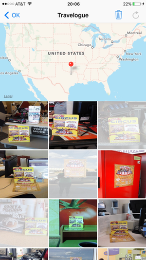

# &nbsp;&nbsp;&nbsp;&nbsp;&nbsp;VirtualTourist

VirtualTourist allows the user to drop a pin on a map, and then download photos from Flickr that are tagged with this location.  The photos and their relationship with the location of the pin are persisted across app sessions.

## Project

VirtualTourist is Portfolio Project #4 of the Udacity iOS Developer Nanodegree Program.  The following list contains pertinent course documents:
* [Udacity App Specification](./Paperwork/Udacity/UdacityAppSpecification.pdf)  
* [Udacity Grading Rubric](./Paperwork/Udacity/UdacityGradingRubric.pdf)  
* [GitHub Swift Style Guide](./Paperwork/Udacity/GitHubSwiftStyleGuide.pdf)  
* [Udacity Git Commit Message Style Guide](./Paperwork/Udacity/UdacityGitCommitMessageStyleGuide.pdf)  
* [Udacity Project Review](./Paperwork/Udacity/ProjectReview.pdf)  

|               | Project Submission       | Current State |
| :----------   | :-------------           | :------------ |
| Grade:        | ***Meets Expectations*** | No Change     |
| GitHub Tag:   | v1.0                     |
| App Version:  | 1.0                      |
| Environment:  | Xcode 7.3 / iOS 9.3      |
| Devices:      | iPhone Only              |
| Orientations: | Portrait Only            |

## Design

### Data Persistence

The app's data persistence apparatus is comprised of the following:

* Core Data - manages data from the following relational entity–attribute model:
  - Travel Location - represented by latitude/longitude.  A Travel Location may be related to zero, one or many Travel Photos.
  - Travel Photo - represented by Flickr URL.  A Travel Photo may be related to one and only one Travel Location.
* File System - images downloaded using Flickr URLs are saved in the Documents directory of the app.
* Memory Cache - keeps recently manipulated images in memory for faster access.

When fetching the image indicated by a Travel Photo:

* Check the memory cache for the image.  YES = get the image, NO = next step
* Check the app's Documents directory for the image.  YES = read the image, NO = next step
* Download the image from Flickr using the supplied URL.
* When download is complete, put the image in the memory cache and Documents directory.

Deletion:

* When a Travel Location is removed from Core Data, all of the related Travel Photos are also removed.
* When a Travel Photo is removed from Core Data, the associated image is removed from the Documents directory and from the memory cache.

### Travel Locations View

TABLE 1 - Travel Locations View 

| **Travel Locations View** | **Pin Deletion Mode** | 
| :-----------------------: | :-------------------: |
|  |  | 

TABLE 2 - Navigation Bar Buttons 

| Refresh | Trash |
| :---:   | :---: |
|  |  | 

Upon app launch, the initial view is the **Travel Locations View**.  A map view is presented, and pins are dropped at any Travel Locations that were saved at the end of the previous app session.  

* Tap & hold (i.e. long press) a spot on the map to drop a pin at that location & to save that Travel Location in the persistence apparatus.
* Tap a pin to transition to the **Travelogue View** in order to display photos tagged with the lat/long of the pin.
* Tap the **Trash** button in the navigation bar to enter **Pin Deletion Mode**.  Instructions for using this mode appear in an alert view, tap **OK** to dismiss.  Tap a pin in this mode to remove the Travel Location & any related Travel Photos from the persistence apparatus.

### Travelogue View

TABLE 3 - Travelogue View : Present Images

| **Travelogue View** | **Images Actively Downloading**  | **No Photos** |
| :-----------------: | :------------------------------: | :-----------: |
|  |  |  |

This view consists of a map segment with a pin dropped at the Travel Location and a collection of up to 21 images that are related to the Travel Location.

* Tap the **< OK** button in the navigation bar at any time to return to the **Travel Locations View**.
* Tap the **Refresh** button in the navigation bar in order to download a new group of images from Flickr.
  - 21 images are requested;  however, any number ⋲ [0, 21] of images returned is valid.  
* When a collection cell is waiting for its assigned image to be downloaded, the cell is blue with an animating white activity indicator in the center.
* While images are being downloaded, the network activity indicator in the status bar is active.

TABLE 4 - Travelogue View : Delete Images

| **Delete Selected Photos** | 
| :------------------------: | 
|  | 

* Only *selected* photos can be deleted.
* A *selected* photo appears to be washed out as compared to a *deselected* photo.
* Tapping a photo alternates its *selected/deselected* status.
* The **Trash** button is available only if at least one photo is *selected*.
* Tap the available **Trash** button to remove the selected photos from the persistence apparatus and the collection view.

### iOS Frameworks & GCD

- [CoreData](./Paperwork/READMEFiles/CoreData.md)
- [CoreLocation](./Paperwork/READMEFiles/CoreLocation.md)
- [Foundation](./Paperwork/READMEFiles/Foundation.md)
- [MapKit](./Paperwork/READMEFiles/MapKit.md)
- [UIKit](./Paperwork/READMEFiles/UIKit.md)
- [Grand Central Dispatch](./Paperwork/READMEFiles/GCD.md)

### Web APIs

[Flickr API](https://www.flickr.com/services/api/) - Use as public source of photos.  Get photos tagged with a given lat/long.  [Website](https://www.flickr.com/) and [Terms of Service](https://policies.yahoo.com/us/en/yahoo/terms/utos/index.htm).

### 3rd-Party

* *GitHub Swift Style Guide* lives in this [repo](https://github.com/github/swift-style-guide).
* `Swift.gitignore`, the template used to create the local `.gitignore` file, lives in this [repo](https://github.com/github/gitignore).

---
**Copyright © 2016 Gregory White. All rights reserved.**
